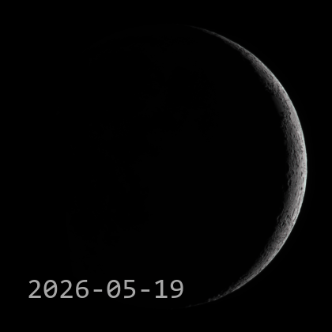
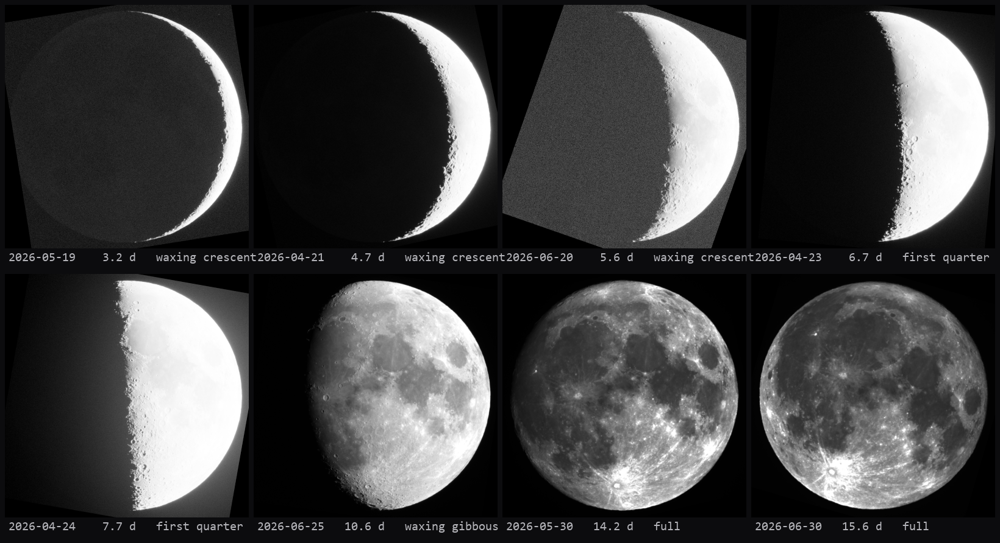

# Lunation (standalone)

PixInsight-free port of [Lunation for PixInsight](https://github.com/dmead/lunation-pixinsight) — a
lunar lucky-imaging pipeline (SER decode → quality ranking → sub-pixel
registration → drizzle stacking → finishing → phase-ordered lunation
animation) as a plain Python package.

## Who this is for

You dabble in full-disk Moon imaging. Over a few months you've caught the
Moon at different phases — a thin crescent one night, a fat gibbous
another, the odd full Moon — as SER captures (and maybe a few
already-finished stills). You'd like to turn that scattered collection
into a single, clean **animation of the Moon cycling through its
phases**, without hand-driving AutoStakkert / PIPP for every night and
without owning PixInsight.

Lunation does exactly that. Point it at the folders where your captures
live and it will:

1. **Find and preview** every SER capture and finished image, grouped by
   night in phase order — with an instantly assembled **aligned preview**
   (one frame per night, disk-stable, correctly oriented) so you can
   judge the season before spending compute on it.
2. **Stack** each checked night (per filter, with drizzle chosen from the
   capture's optics), then **finish** the LRGB result — parallel jobs
   with live per-row progress.
3. **Assemble the lunation**: order every finished Moon by lunar phase,
   register and orient them consistently (north up, disk stable in the
   frame), and render a phase-ordered **GIF / MP4** animation.

No AutoStakkert, no PIPP, no PixInsight, no Node.

## Examples

A season of captures, stacked, finished, disk-stabilized, and encoded by
this pipeline (`lunation run` end to end — 27 nights, phase-ordered):



The GUI's aligned preview, built straight from **raw SER captures** — one
decent frame per night, disk-fit, rotation-registered by the same chain
the animation uses, no stacking or finishing (this is what Scan assembles
so you can judge a season before spending compute on it):



## Installation

[uv](https://docs.astral.sh/uv/) manages everything, including Python
itself — no system Python needed.

```bash
# CLI only
uv tool install git+https://github.com/dmead/lunation

# CLI + desktop GUI (Qt)
uv tool install 'lunation[gui] @ git+https://github.com/dmead/lunation'

# or from a checkout
uv tool install .          # add '.[gui]' for the GUI

lunation --help
```

`ffmpeg` on PATH is needed for `avi2ser` and the mp4 encode (on Windows:
`choco install ffmpeg` or `winget install ffmpeg`).

Prefer a double-click app? Each
[release](https://github.com/dmead/lunation/releases) has standalone
desktop bundles — `Lunation-<version>-windows-x64.zip` and
`Lunation-<version>-macos-*.zip` — no Python needed; unzip and run. The
same binary is the CLI when given arguments (`Lunation.exe run <root>`).

## Desktop GUI

```bash
lunation gui [--output <dir>]
```

① add search paths and **Scan** — captures and finished images are found,
grouped by night in phase order (channel inference, moon-phase labels),
and the aligned preview assembles itself; ② review the inputs — check
what to run, double-click FL / px cells to set a capture's optics (drives
its drizzle), click a row to preview it, Blink / Align / Play to ride
through the season; ③ set concurrency (live — lowering it suspends jobs,
raising resumes them); ④ pick the output directory; ⑤ **Start**. Per-row
progress bars aggregate each night's jobs, a log pane tails the selected
job, and the output folder opens when the run completes.

Each run stores the configuration it generated **with the output**, in a
`lunation_<id>` run directory — a hand-tuned config added via *Add
file(s)…* always runs verbatim.

## Run (CLI)

```bash
# full pipeline over a production root (configs/auto/*.json sessions):
# stack -> finish -> gif frames (soft deps) -> encode
lunation run <root> [--sessions 2026-06-30] [--jobs 1] [--no-gif]

# individual stages (same configs/artifacts as the old pipeline)
lunation stack --config configs/<dataset>.json [--out-root out/py/...]
lunation finish configs/auto/finish-<name>.json
lunation render <framesDir> --root <root>
lunation encode <framesDir>
lunation trim <in.ser> <out.ser> <keep> <log>
lunation avi2ser <in.avi> <out.ser>
```

Job success/failure is read from the per-job logs (`=== STACK OK`,
`*** FINISH FAILED: …`), the same sentinel contract the PixInsight-era
tailers used, so stages still mix freely with the old pipeline.

## Development

```bash
# uv manages everything incl. Python itself (no system Python needed)
. scripts/py.sh      # keeps uv caches off C: locally
uv sync
uv run pytest -q
```
